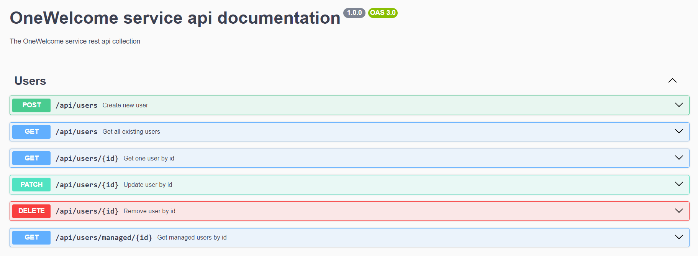

<p align="center">
  <a href="http://nestjs.com/" target="blank"></a>
</p>

[circleci-image]: https://img.shields.io/circleci/build/github/nestjs/nest/master?token=abc123def456
[circleci-url]: https://circleci.com/gh/nestjs/nest

## Description

OneWelcome test task.

## Installation

```bash
$ nvm use 18.16.0 (> 18.0.0)
$ npm install
```

## Running the app

```bash
# development
$ npm run start
```

## Swagger documentation

```
$ open browser and visit http://localhost:3000/api

```


